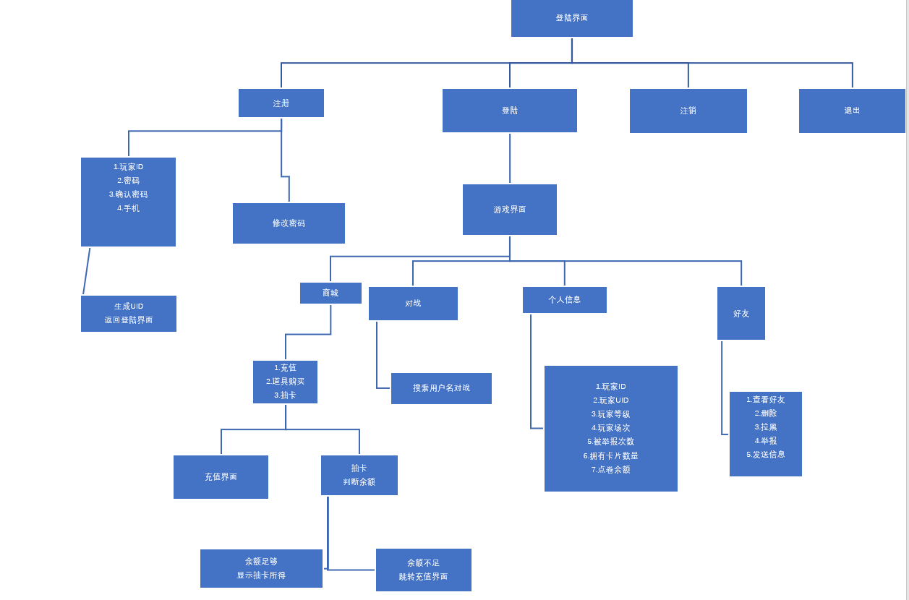

# Mooer Village Knights Cards

## full version of JavaClosingHomework

<h1>

</h1>
<h2>

## Members

- [SaarChaffee](https://github.com/saarchaffee)
- [Evistix](https://gitee.com/Evistix)
- [BingyeAkie](https://gitee.com/BingyeAkie)
- [arua](https://gitee.com/arua)

## Main Function

- Gacha
- Khorium
- 1v1 Battle
- Friend

[comment]: <> (### Details please read documents[docs]&#40;docs/api.md&#41;)

## Realization method

- [Realization method](docs/EndIntroduction.md)

## Main Repository

- [MooerVillageKnightsCards](https://github.com/SaarChaffee/MooerVillageKnightsCards)

## Submodules

- [full version of Back-end](https://github.com/saarchaffee/JavaClosingHomework)

## Requirement

- [mssql-jdbc-9.2.1.jre8](https://docs.microsoft.com/zh-cn/sql/connect/jdbc/download-microsoft-jdbc-driver-for-sql-server?view=sql-server-ver15)
- Netbeans 8.0

</h2>

## Structure Tree View

  

